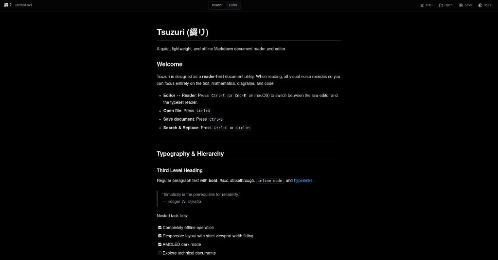
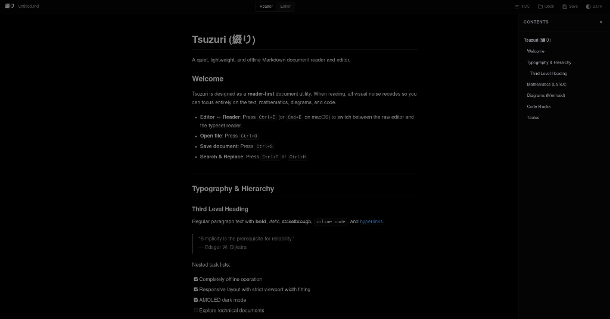
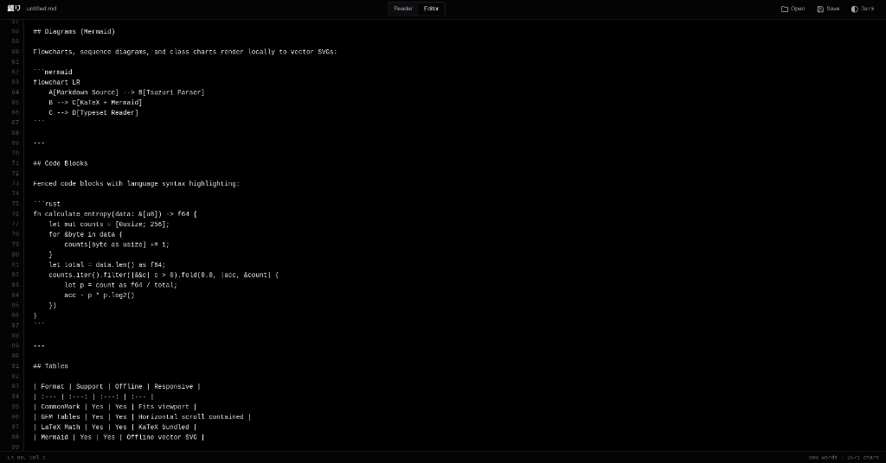
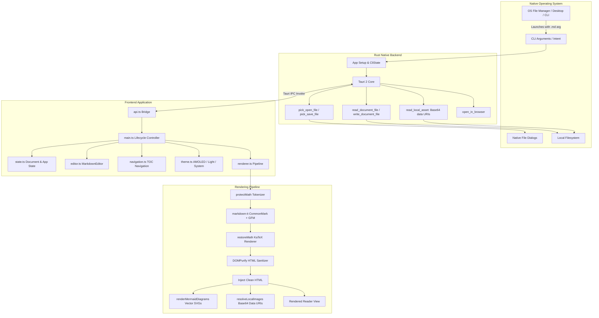

<p align="center">
  
</p>

# Tsuzuri (綴り)

A lightweight, completely offline, cross-platform Markdown document reader and editor built with Tauri 2, Rust, and TypeScript.

The name **Tsuzuri** refers to Japanese **綴り**, associated with **spelling, binding, and composing/weaving words**. The product reflects this purpose: a quiet, focused tool for reading and composing documents without distraction.

---

## Overview & Philosophy

Tsuzuri is a **reader-first** document application. Unlike traditional split-pane Markdown editors with permanently competing source and preview views, Tsuzuri has exactly two mutually exclusive views:

1. **Reader**: A typeset, read-only document view optimized for typographic clarity, inline mathematics, vector diagrams, and syntax-highlighted code.
2. **Editor**: A clean, distraction-free raw Markdown source editor with synchronized line numbers, search and replace, undo/redo history, and unsaved changes tracking.

Only one view is active at any given moment. Switching between views is instant (`Ctrl+E` or `Cmd+E`), preserving document state, scroll positions, and modifications.

---

## Features

- **Reader-First Experience**: Typeset document presentation with hierarchy, comfortable line lengths, and readable contrast.
- **Mutually Exclusive Views**: Single-view interface switching between Reader and Editor (`Ctrl+E`). No split panes, no resizable dividers, no visual clutter.
- **Strict Viewport Width Fitting (Zero Horizontal Scroll)**: The document layout is engineered so that text, long URLs, unbroken identifiers, code blocks, tables, LaTeX formulas, and Mermaid diagrams adapt to the viewport without causing document-level horizontal scrolling.
- **100% Offline Operation**: Zero runtime network requests. KaTeX fonts and styles, Mermaid vector renderer, Highlight.js language modules, and Markdown-it extensions are all bundled locally.
- **LaTeX Mathematics**: High-performance offline mathematical typesetting via bundled KaTeX for inline expressions (`$E = mc^2$`) and display equations (`$$\int_{-\infty}^{\infty} e^{-x^2} dx = \sqrt{\pi}$$`).
- **Mermaid Diagrams**: Offline client-side rendering of flowcharts, sequence diagrams, class diagrams, state diagrams, and entity-relationship charts directly to sharp vector SVGs. Gracefully handles syntax errors with localized fallback boxes.
- **Syntax Highlighting**: Language-aware highlighting for common programming languages with discreet on-hover copy controls.
- **Native `.md` File Associations**: Registered native file associations for `.md`, `.markdown`, `.mdown`, and `.mkdn` across supported operating systems, enabling double-click opening, "Open With", and command-line file launching.
- **AMOLED-Oriented Dark Mode**: True black surfaces (`#000000`) for OLED power efficiency and high-contrast night reading, accompanied by a paper-like Light mode and an automatic System mode.
- **Document Navigation**: Temporary Table of Contents (TOC) slide-over drawer that generates an interactive heading tree without permanently consuming screen real estate.
- **Search & Replace**: Integrated find and replace bar in Editor view (`Ctrl+F`, `Ctrl+H`) with match counts, next/previous navigation, and replace-all capabilities.
- **Local Relative Images**: Native background resolution of relative image paths (``) relative to the loaded document's directory.
- **Security & Sanitization**: HTML sanitization powered by DOMPurify with strict Content Security Policy (CSP), isolating external links to the default system browser.

---

## Screenshots

### Reader View (AMOLED Dark)
*Typeset reading mode with high-contrast typography, zero visual noise, and AMOLED true black background.*



### Table of Contents Navigation Drawer
*Slide-over outline drawer for instant document heading jumps without cluttering the screen.*



### Raw Markdown Editor
*Monospace distraction-free editing surface with synchronized line numbering gutter and real-time word/character count.*



---

## Architecture

Tsuzuri uses **Tauri 2** with a native Rust backend and a lightweight, zero-framework TypeScript frontend bundled via Vite.



### Frontend State Machine
- Single active document loaded in memory (`path`, `fileName`, `directory`, `content`, `savedSnapshot`, `isDirty`).
- Exactly two mutually exclusive view panes (`#reader-view` and `#editor-view`).
- Theme state persisted in `localStorage` (`tsuzuri_theme`: `'system'` | `'light'` | `'dark'`).

---

## Rendering Pipeline & Viewport Fitting

### 1. The Rendering Flow
1. **Math Protection**: Mathematical expressions outside fenced code blocks are extracted and replaced with unique delimited tokens (`@@MATH_BLOCK_n@@`, `@@MATH_INLINE_n@@`) to prevent markdown-it from misinterpreting TeX characters (such as underscores `_` or asterisks `*`) as markdown emphasis.
2. **Markdown Parsing**: Markdown source is converted to semantic HTML using CommonMark and GitHub-Flavored Markdown rules (tables, task lists, footnotes, strikethrough).
3. **LaTeX Math Restoration**: Math tokens are passed to KaTeX (`katex.renderToString`). Display equations are wrapped in `.katex-display-wrapper` with `throwOnError: false` so malformed expressions display an inline error indicator without halting document processing.
4. **HTML Sanitization**: DOMPurify filters dangerous tags (`<script>`, `<iframe>`, `<object>`) and malicious event attributes while preserving MathML, SVG, and presentation markup.
5. **DOM Injection & Async Enhancements**:
   - Local relative image sources (``) are resolved via Rust IPC into offline `data:` URIs.
   - Mermaid diagram blocks (`<div class="mermaid-diagram">`) are rendered into sharp SVG elements using bundled Mermaid. Malformed diagrams display a fallback source box.

### 2. Absolute No-Horizontal-Scroll Engineering
Document-level horizontal scrolling is strictly eliminated across all viewports (tested from 320 px to 1440 px):
- **Document Root**: `html, body { width: 100%; max-width: 100vw; overflow-x: hidden; }`
- **Reader Container**: `#reader-view { width: 100%; max-width: 100%; overflow-x: hidden; }`
- **Unbroken Strings and Long URLs**: `overflow-wrap: anywhere; word-break: break-all;`
- **Code Blocks**: `pre.hljs { overflow-x: hidden; white-space: pre-wrap; word-break: break-word; overflow-wrap: anywhere; }`
- **LaTeX Display Math**: `.katex-display-wrapper { max-width: 100%; overflow-x: auto; overflow-y: hidden; }` prevents wide formulas from pushing the document boundaries.
- **Tables**: Tables are wrapped in `.table-wrapper { width: 100%; max-width: 100%; overflow-x: auto; }` allowing wide tabular data to scroll within its localized boundary while keeping the page locked to viewport width.
- **Mermaid Diagrams**: Responsive SVGs styled with `max-width: 100% !important; height: auto !important;`.

---

## Offline Architecture

Tsuzuri operates completely offline:
- **No External CDNs**: All scripts and stylesheets are compiled directly into the application bundle at build time.
- **Embedded Fonts**: KaTeX mathematical fonts (`.woff`, `.woff2`) are bundled directly into `dist/assets/`. System fonts (`-apple-system`, `system-ui`, monospace) are used for document text and code.
- **Content Security Policy (CSP)**: The WebView is restricted by CSP:
  ```text
  default-src 'self'; script-src 'self' 'unsafe-eval' 'unsafe-inline'; style-src 'self' 'unsafe-inline'; img-src 'self' data: blob:; font-src 'self' data:; connect-src 'self'; object-src 'none';
  ```
- **Zero Telemetry**: No analytics, telemetry, crash reporting, tracking scripts, or cloud sync services are included.

---

## Platform Support

| Platform | Support Status | Native Integration Details |
| :--- | :---: | :--- |
| **Linux (x86_64)** | **Tested & Verified** | Native GTK3/WebKitGTK app, `.deb` package with desktop entry, MIME type `text/markdown`, CLI arg launching. |
| **Windows** | **Configured** | Tauri 2 Windows configuration, file associations registered for `.md` in registry, native file dialogs. |
| **macOS** | **Configured** | Bundle configured with UTI `net.daringfireball.markdown`, `CFBundleDocumentTypes`, native sheet dialogs. |
| **Android** | **Configured** | Android manifest configured with `ACTION_VIEW` intent filter for `text/markdown`. |
| **iOS** | **Configured** | `Info.plist` document types declared for Markdown handling. |

*Note on Testing*: Linux (Debian/Ubuntu/x86_64) has been compiled, packaged, executed, and tested directly on the target machine. Windows, macOS, Android, and iOS share the unified Rust core and Tauri 2 configuration, but require their respective native toolchains (Xcode, MSVC, Android Studio) for binary artifact generation.

---

## Native File Associations

When launching Tsuzuri with a Markdown file:
1. The operating system passes the file path via `std::env::args()`.
2. The Rust backend extracts the argument in `setup()` and records it in `CliState`.
3. Upon initialization, the frontend queries `get_cli_target_file()` and loads the document immediately in **Reader** view.

### OS-Specific Registration
- **Linux**: The generated `.deb` package installs `/usr/share/applications/tsuzuri.desktop` declaring:
  ```desktop
  Exec=tsuzuri %F
  MimeType=text/markdown;text/x-markdown;text/plain;
  Categories=Utility;
  ```
- **Windows**: The WiX / NSIS installer registers Tsuzuri as a registered handler for `.md`, `.markdown`, `.mdown`, and `.mkdn`.
- **macOS**: `CFBundleDocumentTypes` declares the document role as `Editor` with `net.daringfireball.markdown`.
- **Android**: `<intent-filter>` accepts `android.intent.action.VIEW` for MIME type `text/markdown`.

---

## Development Setup

### Prerequisites
- **Node.js**: v20+ or v24+ (`node --version`)
- **npm**: v10+ or v11+ (`npm --version`)
- **Rust**: 1.85+ (`rustc --version`, `cargo --version`)
- **Linux Packages** (Debian/Ubuntu):
  ```bash
  sudo apt install libwebkit2gtk-4.1-dev build-essential curl wget file libxdo-dev libssl-dev libayatana-appindicator3-dev librsvg2-dev
  ```

### Installation
```bash
# Clone the repository
git clone https://github.com/ameya-deshpande-5056/tsuzuri.git
cd tsuzuri

# Install dependencies
npm install
```

### Running in Development
```bash
# Start frontend and native Tauri window in dev mode
npm run tauri dev
```

### Running Tests
```bash
# Run unit and viewport layout test suite
npm test
```

---

---

## Building Production Binaries

### 1. Linux (`.deb` and native binary)
```bash
# Build production Debian package and standalone binary
npm run tauri build
```
Artifacts will be located at:
- Standalone Executable: `src-tauri/target/release/tsuzuri`
- Debian package: `src-tauri/target/release/bundle/deb/tsuzuri_1.0.0_amd64.deb`

To install locally on Debian/Ubuntu/Mint/Pop!_OS:
```bash
sudo dpkg -i src-tauri/target/release/bundle/deb/tsuzuri_1.0.0_amd64.deb
```

---

### 2. Windows (`.msi` and NSIS `.exe` installer)
Run on a Windows host (or automatically via GitHub Actions):
```bash
# 1. Install Windows target
rustup target add x86_64-pc-windows-msvc

# 2. Build production installers
npm run tauri build -- --target x86_64-pc-windows-msvc
```
Artifacts will be located at:
- NSIS Setup Installer: `src-tauri/target/x86_64-pc-windows-msvc/release/bundle/nsis/tsuzuri_1.0.0_x64-setup.exe`
- WiX MSI Package: `src-tauri/target/x86_64-pc-windows-msvc/release/bundle/msi/tsuzuri_1.0.0_x64_en-US.msi`

---

### 3. macOS (`.dmg` and `.app` bundle)
Run on a macOS host (or automatically via GitHub Actions):
```bash
# 1. Install Apple Darwin targets
rustup target add aarch64-apple-darwin x86_64-apple-darwin

# 2. Build universal binary and disk image (.dmg)
npm run tauri build -- --target universal-apple-darwin
```
Artifacts will be located at:
- Apple Disk Image: `src-tauri/target/universal-apple-darwin/release/bundle/dmg/tsuzuri_1.0.0_universal.dmg`
- macOS Application Bundle: `src-tauri/target/universal-apple-darwin/release/bundle/macos/tsuzuri.app`

---

### 4. Android (`.apk` and `.aab`)

#### Prerequisites
1. **Android SDK & NDK**: Installed via Android Studio (e.g. at `~/Android/Sdk`).
2. **Java JDK**: JDK 17 or JDK 21 (e.g. `/opt/android-studio/jbr` or OpenJDK).
3. **Android Rust toolchains**:
   ```bash
   rustup target add aarch64-linux-android armv7-linux-androideabi i686-linux-android x86_64-linux-android
   ```

#### Build Commands
```bash
# 1. Initialize Android project (already generated under src-tauri/gen/android)
npx tauri android init

# 2. Build Debug APK (instantly runnable on test devices):
npx tauri android build --apk --debug

# 3. Build Release APK (optimized, stripped binary):
npx tauri android build --apk

# 4. Build Android App Bundle (.aab) for Google Play Store:
npx tauri android build --aab
```

#### Output Locations
- Debug APK: `src-tauri/gen/android/app/build/outputs/apk/universal/debug/app-universal-debug.apk`
- Release APK: `src-tauri/gen/android/app/build/outputs/apk/universal/release/app-universal-release-unsigned.apk`
- Release AAB: `src-tauri/gen/android/app/build/outputs/bundle/universalRelease/app-universal-release.aab`

#### Signing the APK
To sign your release APK with your keystore:
```bash
# Generate a keystore if you don't have one:
keytool -genkey -v -keystore my-release-key.jks -keyalg RSA -keysize 2048 -validity 10000 -alias my-alias

# Sign the APK with apksigner (from Android SDK build-tools):
$ANDROID_HOME/build-tools/36.0.0/apksigner sign --ks my-release-key.jks --ks-key-alias my-alias \
  src-tauri/gen/android/app/build/outputs/apk/universal/release/app-universal-release-unsigned.apk
```

#### Android Studio GUI
You can also open the project directly in Android Studio:
```bash
npx tauri android open
```
Then use **Build > Build Bundle(s) / APK(s) > Build APK(s)**.

---

### 5. iOS (`.ipa` and `.app`)

> **Apple Platform Requirement**: Compiling iOS applications and generating `.ipa` archives requires a **macOS** environment with **Xcode** installed, as mandated by Apple's codesigning, SDK, and `xcodebuild` requirements.

#### Prerequisites (on macOS)
1. **Xcode**: Installed from Mac App Store, plus command-line tools:
   ```bash
   xcode-select --install
   ```
2. **iOS Rust targets**:
   ```bash
   rustup target add aarch64-apple-ios x86_64-apple-ios aarch64-apple-ios-sim
   ```

#### Build Steps
```bash
# 1. Initialize Xcode project under src-tauri/gen/apple/
npx tauri ios init

# 2. Build iOS application binary:
npx tauri ios build
```

#### Generating Signed `.ipa` via Xcode GUI (Recommended)
```bash
open src-tauri/gen/apple/tsuzuri.xcodeproj
```
1. In Xcode, select the `tsuzuri` target. Under **Signing & Capabilities**, select your **Team** (free personal Apple ID or paid Apple Developer Program).
2. Set the destination device to **Any iOS Device (arm64)**.
3. Select **Product > Archive**.
4. In the Organizer window, click **Distribute App**.
5. Select **App Store Connect**, **Ad Hoc**, or **Development** / **Custom**.
6. Follow the wizard to export the `.ipa` package.

#### Creating Unsigned `.ipa` for Sideloading (AltStore / Sideloadly)
```bash
cd src-tauri/gen/apple/build/arm64
mkdir Payload
cp -r tsuzuri.app Payload/
zip -r tsuzuri.ipa Payload
```

---

## Automated Multi-Platform GitHub Releases Workflow

Tsuzuri includes automated GitHub Actions workflows to build and publish release binaries for all 5 platforms directly to the **Releases** section of your GitHub repository.

### Workflow Files
1. [`.github/workflows/release.yml`](.github/workflows/release.yml):
   - **Linux**: Compiles on `ubuntu-22.04` and publishes `.deb`.
   - **Windows**: Compiles on `windows-latest` and publishes `.exe` (NSIS) and `.msi`.
   - **macOS**: Compiles on `macos-latest` and publishes `.dmg` (Universal).
   - **Android**: Compiles on `ubuntu-latest` with NDK and publishes `tsuzuri-android.apk`.
   - **iOS**: Compiles on `macos-14` with Xcode and publishes `tsuzuri-ios-unsigned.ipa`.
2. [`.github/workflows/build-mobile.yml`](.github/workflows/build-mobile.yml):
   - CI build on pull requests and pushes that validates Android and iOS compilation.

### How to Trigger an Automated Release

To automatically build and attach all platform binaries to a GitHub Release:

```bash
# 1. Commit and push your changes
git add .
git commit -m "chore: prepare release v1.0.0"
git push origin master

# 2. Create and push a version tag
git tag v1.0.0
git push origin v1.0.0
```

Once pushed, GitHub Actions will:
1. Spin up Ubuntu, Windows, and macOS cloud runners concurrently.
2. Compile and package the native binaries for all five platforms.
3. Create a **GitHub Release** tagged `v1.0.0` with the downloadable files:
   - `tsuzuri_1.0.0_amd64.deb` (Linux)
   - `tsuzuri_1.0.0_x64-setup.exe` (Windows)
   - `tsuzuri_1.0.0_universal.dmg` (macOS)
   - `tsuzuri_1.0.0.apk`
   - `tsuzuri_1.0.0.ipa`

You can also trigger a release manually at any time by going to **Actions > Release > Run workflow** on GitHub.


---

## Testing & Quality Verification

Tsuzuri includes comprehensive test coverage:
1. **Automated Unit Tests (`tests/renderer.test.ts`)**:
   - Heading slug generation and extraction for Table of Contents.
   - GFM features: bold, italic, strikethrough, nested lists, task lists, footnotes.
   - KaTeX inline and display math offline rendering.
   - KaTeX graceful error handling on malformed expressions.
   - Mermaid fenced block extraction.
   - Syntax-highlighted code blocks with copy controls.
   - DOMPurify HTML sanitization.
2. **Editor Tests (`tests/editor.test.ts`)**:
   - Gutter line numbering synchronization.
   - History undo / redo stack behavior.
   - Search find, next, prev, and replace operations.
3. **Viewport Width Fitting Tests (`tests/layout_viewport.test.ts`)**:
   - Layout tested across 320 px (iPhone SE), 375 px (iPhone 13 mini), 430 px (iPhone 14 Pro Max), 768 px (Tablet), 900 px (Narrow Desktop), and 1440 px (Wide Desktop).
   - Verifies zero document-level horizontal scrolling.
4. **Manual Test Document (`test_document.md`)**:
   - Contains all combinations of headings, mathematical formulas, wide matrices, sequence diagrams, class diagrams, flowcharts, malformed LaTeX, malformed Mermaid, long URLs, unbroken character strings, wide data tables, and local images.

---

## Project Structure

```text
tsuzuri/
├── index.html                   # Lightweight application shell
├── package.json                 # Node scripts and dependencies
├── tsconfig.json                # TypeScript compiler configuration
├── vite.config.ts               # Vite offline bundler configuration
├── test_document.md             # Comprehensive manual and automated test document
├── sample_image.png             # Sample local asset for relative image tests
├── LICENSE                      # GNU General Public License v3.0
├── public/                      # Static web assets & application icons
├── docs/
│   └── screenshots/             # Dark mode desktop application screenshots
├── src/
│   ├── main.ts                  # App lifecycle, routing, keyboard shortcuts, drag-and-drop
│   ├── state.ts                 # Document state, view mode, theme state
│   ├── renderer.ts              # Markdown, KaTeX, Mermaid, DOMPurify pipeline
│   ├── editor.ts                # Raw editor, line gutter numbers, find/replace
│   ├── navigation.ts            # Table of Contents temporary drawer
│   ├── theme.ts                 # AMOLED Dark, Light, System theme manager
│   ├── api.ts                    # Tauri IPC bridge for native commands
│   ├── types.d.ts               # TypeScript module declarations
│   └── styles/
│       ├── base.css             # Typography tokens, AMOLED palette, CSS reset
│       ├── layout.css           # Chrome, topbar, buttons, segmented toggle
│       ├── reader.css           # Typeset document styles, zero-horizontal-scroll enforcement
│       └── editor.css           # Editor surface, line numbering, find/replace toolbar
├── src-tauri/
│   ├── Cargo.toml               # Rust dependencies and package metadata
│   ├── tauri.conf.json          # Tauri 2 configuration, file associations, CSP
│   ├── build.rs                 # Tauri build script
│   ├── desktopTemplate.desktop  # Linux desktop entry template with %F parameter
│   ├── capabilities/
│   │   └── default.json         # Security capability and permissions
│   ├── icons/                   # Application icons across platforms
│   └── src/
│       ├── main.rs              # Desktop executable entry point
│       └── lib.rs               # Rust native commands (document I/O, assets, dialogs, CLI)
└── tests/
    ├── renderer.test.ts         # Pipeline, KaTeX, Mermaid, sanitization tests
    ├── editor.test.ts           # Editor line numbers, undo/redo, search tests
    └── layout_viewport.test.ts  # Viewport width fitting (320px - 1440px)
```

---

## Keyboard Shortcuts

| Shortcut | Action | Scope |
| :--- | :--- | :--- |
| `Ctrl + E` / `Cmd + E` | Switch view (**Reader ↔ Editor**) | Global |
| `Ctrl + O` / `Cmd + O` | Open Markdown file | Global |
| `Ctrl + S` / `Cmd + S` | Save current document | Global |
| `Ctrl + Shift + S` / `Cmd + Shift + S` | Save As | Global |
| `Ctrl + F` / `Cmd + F` | Open Find toolbar | Editor |
| `Ctrl + H` / `Cmd + H` | Open Find & Replace toolbar | Editor |
| `Enter` / `Shift + Enter` | Find Next / Find Previous match | Find Toolbar |
| `Escape` | Close Find toolbar / Close TOC drawer | Global |
| `Ctrl + Z` / `Cmd + Z` | Undo | Editor |
| `Ctrl + Shift + Z` / `Cmd + Shift + Z` | Redo | Editor |

---

## Direct Dependencies

### Frontend
- `markdown-it`: Fast, CommonMark-compliant Markdown parser.
- `markdown-it-footnote`: Markdown footnote syntax support.
- `markdown-it-task-lists`: GitHub-flavored checkbox task lists.
- `katex`: Lightweight, self-contained offline LaTeX mathematics engine.
- `mermaid`: Offline client-side diagram and flowchart rendering into SVG.
- `highlight.js`: Syntax highlighting across programming languages.
- `dompurify`: Robust client-side HTML sanitization to prevent XSS.

### Native Backend (Rust)
- `tauri` (v2): Native cross-platform application framework.
- `tauri-plugin-dialog`: Native OS file chooser dialogs.
- `tauri-plugin-opener`: Safe link launching in the default system browser.
- `base64`: Encoding local assets for offline display.
- `serde` / `serde_json`: High-speed serialization for IPC data transfer.

---

## Security & Privacy

- **Untrusted Input**: Markdown files are treated as untrusted input. Rendered output is passed through DOMPurify before DOM insertion.
- **Script Execution**: Embedded `<script>` tags, inline event attributes (`onclick`, `onerror`), and `javascript:` URLs are disallowed.
- **External Links**: Clicking external hyperlinks (`http://`, `https://`) invokes the operating system's default browser via `open_in_browser`. Links cannot navigate the internal WebView.
- **Privacy Verification**: Tsuzuri makes zero network connections. No telemetry, user analytics, remote font downloads, or cloud requests occur.

---

## Known Limitations

- **Complex LaTeX Environments**: KaTeX supports standard mathematical equations and AMS environments; advanced custom LaTeX packages (e.g. `tikz`, `pspicture`) that require a full TeX Live distribution are not supported.
- **Mermaid Interactive Callbacks**: For security reasons, interactive Mermaid click callbacks that execute JavaScript are disabled.
- **Massive Documents (> 100,000 lines)**: Rendering very large documents performs parsing and layout in a single pass; rendering time is proportional to document length.

---

## License

Tsuzuri is licensed under the [GNU General Public License v3.0](LICENSE).

