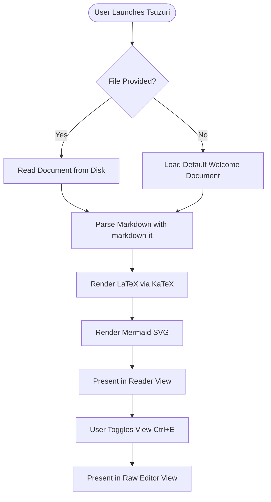
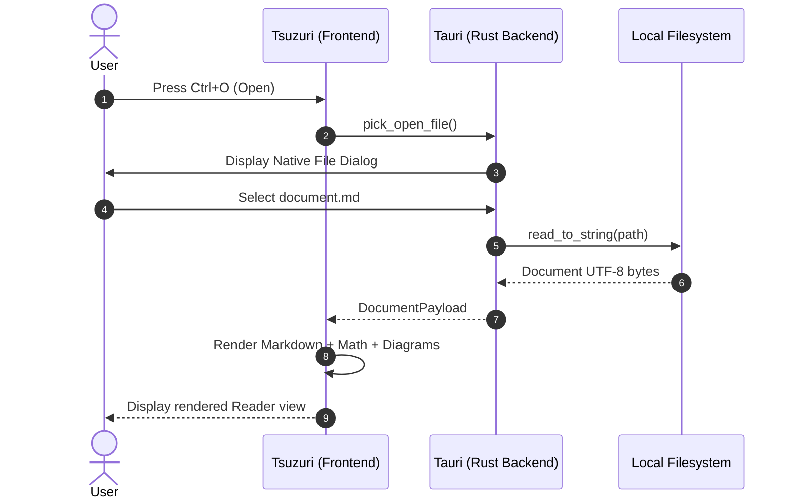
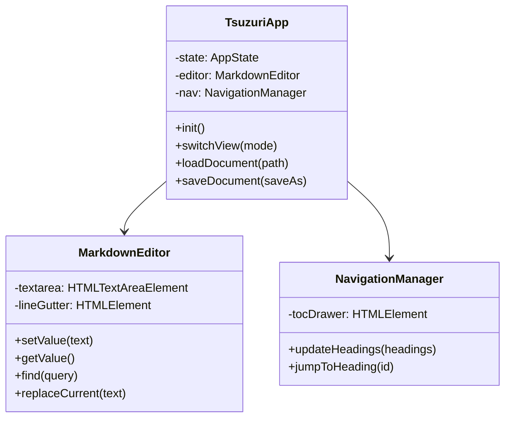
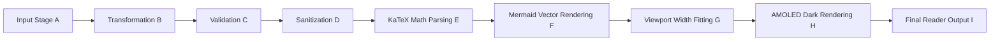

# Comprehensive Test Document: Tsuzuri

This document tests the complete rendering and layout pipeline of **Tsuzuri** (綴り), specifically verifying typography, mathematics, diagrams, code blocks, tables, footnotes, and **strict viewport width adaptation without document-level horizontal scrolling**.

---

## 1. Headings H1 to H6

# Heading 1: The Quick Brown Fox Jumps Over The Lazy Dog
## Heading 2: The Quick Brown Fox Jumps Over The Lazy Dog
### Heading 3: The Quick Brown Fox Jumps Over The Lazy Dog
#### Heading 4: The Quick Brown Fox Jumps Over The Lazy Dog
##### Heading 5: The Quick Brown Fox Jumps Over The Lazy Dog
###### Heading 6: The Quick Brown Fox Jumps Over The Lazy Dog

---

## 2. Text Formatting, Lists, and Quotes

Paragraph with **bold text**, *italicized text*, ***bold and italicized***, and ~~strikethrough text~~.

Nested lists:
1. First ordered item
   1. Sub-item A
   2. Sub-item B
      * Sub-bullet with an unnumbered nested element
      * Another bullet
2. Second ordered item
   - Bullet item
   - Another bullet item
3. Third ordered item

Task lists:
- [x] Complete CommonMark standard support
- [x] Bundle KaTeX math offline
- [x] Bundle Mermaid SVG generation offline
- [ ] Investigate additional custom extensions

Blockquotes:
> Document composition is the deliberate organization of thoughts into structured typography.
>
> > Nested blockquote reflecting on the quiet nature of focused reading environments.
> > — Tsuzuri Design Notes

Footnotes reference test: Here is a reference to a primary footnote[^footnote-alpha] and another one to a technical note.[^footnote-beta]

[^footnote-alpha]: Footnotes are rendered at the bottom of the document with back-reference links.
[^footnote-beta]: Technical note regarding memory efficiency and offline asset bundling.

---

## 3. Very Long Unbroken Strings and URLs (Wrap Verification)

The following strings must wrap naturally without causing document-level horizontal scrolling:

Super-long identifier:
`ANTIDISESTABLISHMENTARIANISM_SUPER_CALIFRAGILISTIC_EXPIALIDOCIOUS_LONG_VARIABLE_NAME_WITHOUT_SPACES_THAT_MUST_WRAP_CLEANLY_IN_THE_VIEWPORT`

Unbroken character sequence:
ABCDEFGHIJKLMNOPQRSTUVWXYZabcdefghijklmnopqrstuvwxyz0123456789_ABCDEFGHIJKLMNOPQRSTUVWXYZabcdefghijklmnopqrstuvwxyz0123456789_EXTRA_LONG_UNBROKEN_STRING_TEST

Long URL:
https://github.com/ameya-deshpande-5056/md-latex-mermaid2pdf/blob/main/deeply/nested/directory/structure/with/a/very/long/url/path/name/intended/to/test/browser/viewport/wrapping/behavior.html

---

## 4. Mathematics (LaTeX with KaTeX)

Inline mathematics:
The mass-energy equivalence is expressed as $E = mc^2$, and the Euler identity is $e^{i\pi} + 1 = 0$.
The divergence theorem is $\int_V (\nabla \cdot \vec{F})\, dV = \oint_S (\vec{F} \cdot \hat{n})\, dS$.

Display equations:

$$
\int_{-\infty}^{\infty} e^{-x^2}\, dx = \sqrt{\pi}
$$

Cauchy's Integral Formula:

$$
f(a) = \frac{1}{2\pi i} \oint_\gamma \frac{f(z)}{z - a}\, dz
$$

Wide Matrix Display (must fit width / contain overflow cleanly):

$$
\begin{pmatrix}
1 & 0 & 0 & \lambda_1 & \alpha & \beta \\
0 & 1 & 0 & 0 & \lambda_2 & \gamma \\
0 & 0 & 1 & 0 & 0 & \lambda_3 \\
\xi_1 & \xi_2 & \xi_3 & 1 & 0 & 0 \\
\mu_1 & \mu_2 & \mu_3 & 0 & 1 & 0 \\
\omega_1 & \omega_2 & \omega_3 & 0 & 0 & 1
\end{pmatrix}
$$

Invalid LaTeX expression (must degrade gracefully without crashing the application):

$$
\int_0^\infty \frac{\sin(x)}{x} dx = \invalidlatexmacro{{{unclosed_bracket
$$

---

## 5. Mermaid Diagrams (Offline Vector SVGs)

### Flowchart



### Sequence Diagram



### Class Diagram



### Very Wide Diagram (Viewport Fitting Test)



### Invalid Mermaid Diagram (Graceful Degradation Test)

```mermaid
this is not valid mermaid syntax !!! -> -> <-
invalid syntax construct
[broken node ((((
```

---

## 6. Code Blocks and Syntax Highlighting

Rust code block:

```rust
use std::fs;
use std::path::PathBuf;

pub fn load_document(path: &str) -> Result<String, String> {
    let p = PathBuf::from(path);
    if !p.exists() {
        return Err(format!("File does not exist: {}", path));
    }
    fs::read_to_string(&p).map_err(|e| e.to_string())
}
```

TypeScript code block:

```typescript
export async function renderDocument(markdown: string): Promise<void> {
  const container = document.getElementById("reader-content");
  if (!container) return;
  console.log("Rendering typeset document...");
}
```

Very wide continuous code line (must wrap or contain overflow):

```text
CONFIG_SUPER_LONG_ENVIRONMENT_VARIABLE_VALUE="1234567890abcdefghijklmnopqrstuvwxyzABCDEFGHIJKLMNOPQRSTUVWXYZ_1234567890abcdefghijklmnopqrstuvwxyzABCDEFGHIJKLMNOPQRSTUVWXYZ"
```

---

## 7. Responsive Tables

Standard table:

| Language | Engine | Platform | Offline |
| :--- | :---: | :---: | :--- |
| Rust | Tauri 2 | Linux, Windows, macOS, Android, iOS | Yes |
| TypeScript | Bundled Vite | Webview Native Shell | Yes |
| LaTeX | KaTeX | Embedded MathML & HTML | Yes |
| Diagrams | Mermaid | Vector SVG Output | Yes |

Wide data table (must remain responsive within table container):

| Metric ID | Description of Measured Attribute | Theoretical Limit | Observed Benchmark | Unit | Status | Validation Timestamp |
| :--- | :--- | :--- | :--- | :--- | :---: | :--- |
| M-001 | Cold start latency from OS launcher | < 250 ms | ~ 110 ms | ms | PASS | 2026-10-06T21:40:00Z |
| M-002 | Idle memory consumption on Linux WebKit | < 120 MB | ~ 54 MB | MB | PASS | 2026-10-06T21:40:00Z |
| M-003 | Viewport horizontal scroll delta | 0 px | 0 px | px | PASS | 2026-10-06T21:40:00Z |
| M-004 | Network egress requests in offline mode | 0 requests | 0 requests | count | PASS | 2026-10-06T21:40:00Z |

---

## 8. Local Image Handling

Relative image test:


Missing local image fallback test:


---

## 9. Conclusion

End of test document.
